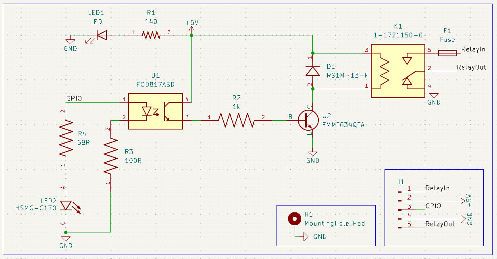
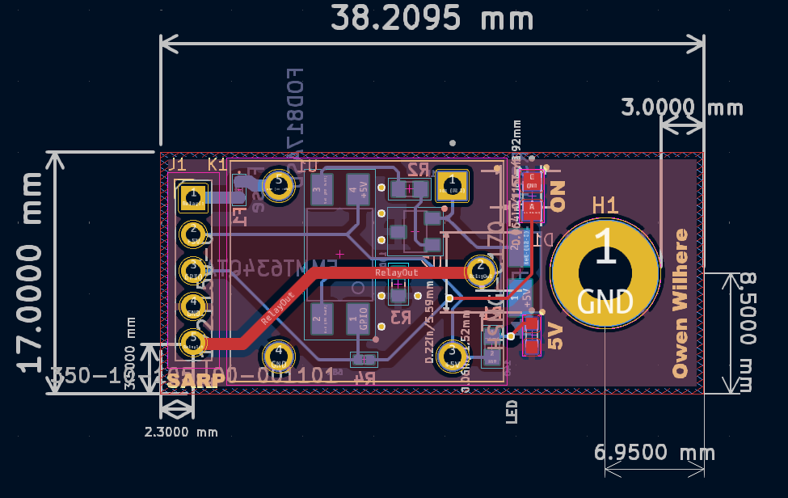

# **Relay Switch Board**

## **Overview**
This is a small relay daughterboard for a rocket launch controller. It lets a low-current 5 V GPIO signal safely switch a fused 5 V power line through an opto-isolated relay, while providing clear power and status indication.

---

## **How It Works**
- **GPIO → Optocoupler**: The GPIO pin drives an optocoupler, isolating the controller from the relay coil circuit.
- **Optocoupler → Transistor**: The optocoupler output drives a transistor that switches current through the relay coil.
- **Protection**: A flyback diode protects the transistor from coil transients.
- **Relay Path**: When energized, the relay connects **RelayIn** to **RelayOut** through a fuse.
- **Indicators**: On-board LEDs show when 5 V is present and when the relay/GPIO is active.

---

## Schematic

## PCB Layout

